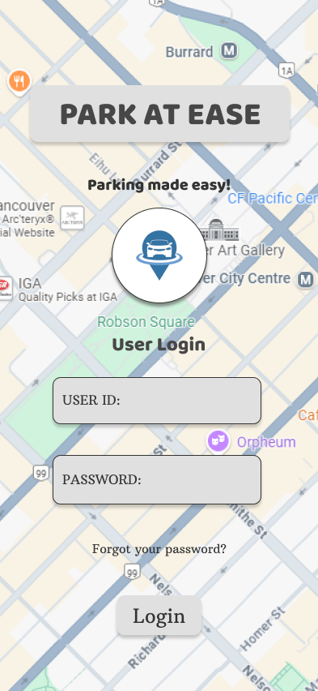
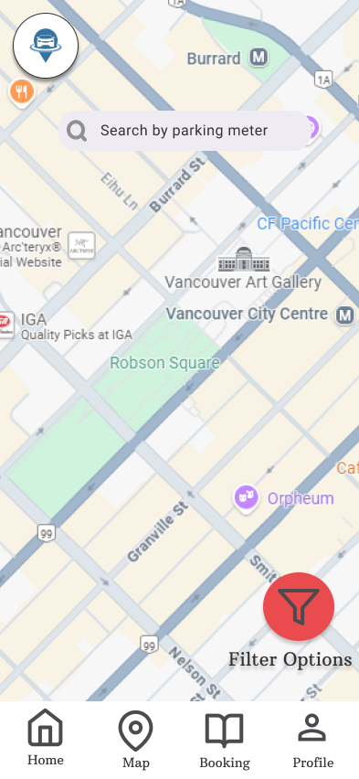
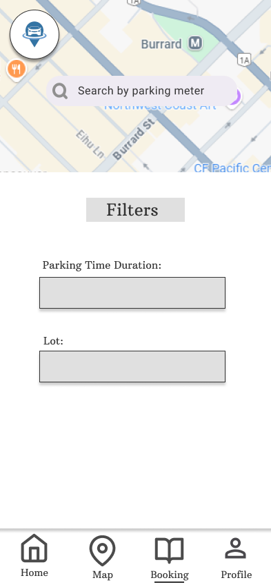
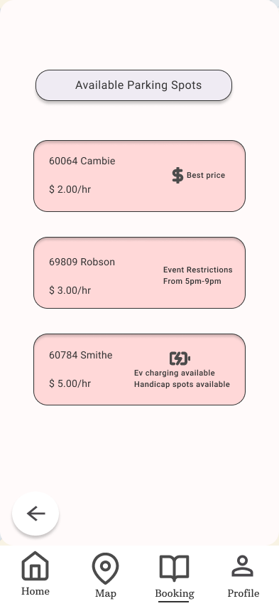
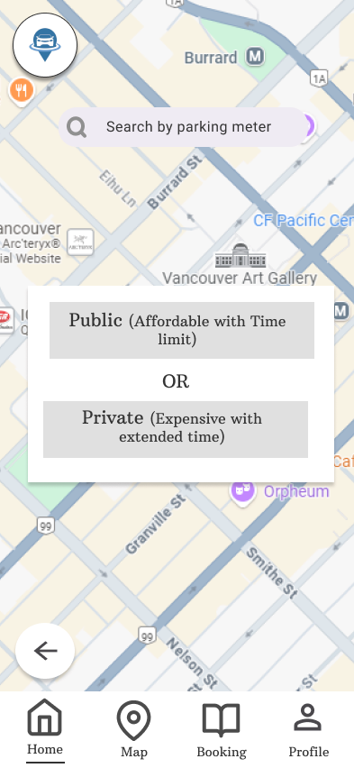
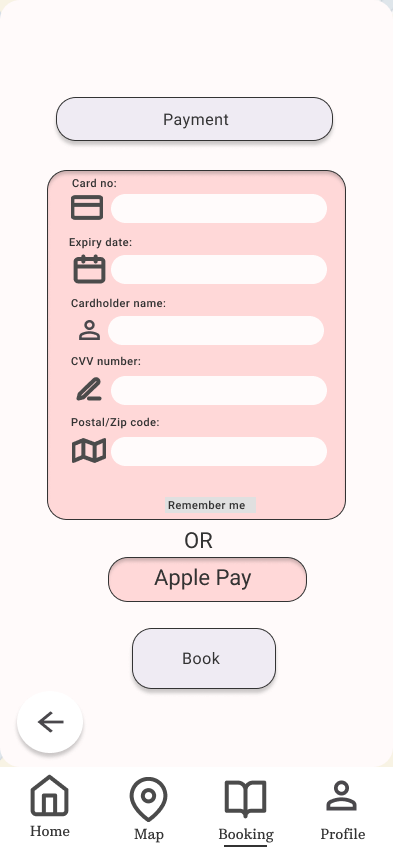
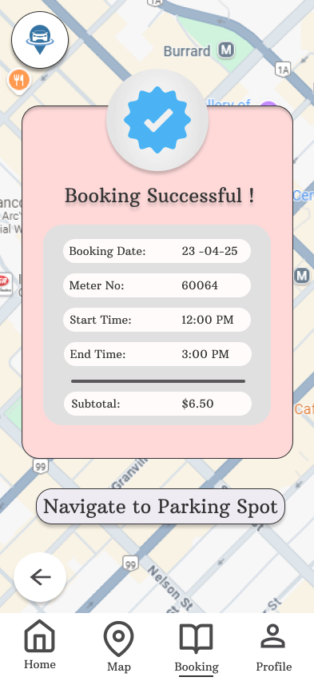
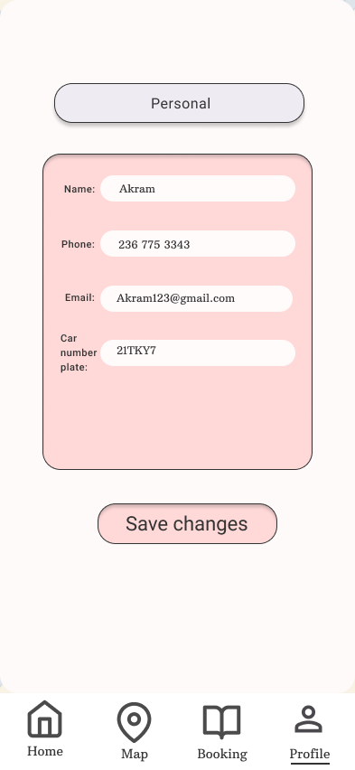

# Park At Ease

Park At Ease is a mobile parking app prototype designed in Figma to help students and urban commuters find, filter, and book parking spots near their destination.

## Figma Prototype
[Figma Prototype Link](## Figma Prototype
[Figma Prototype Link](https://www.figma.com/design/uT4g14WGeVSoLO5jHhSMKg/Untitled?node-id=8-3&t=7PgEVDFNx6HP31u5-1))

## Overview
This project focused on designing a simple and efficient parking experience through a mobile interface. The prototype demonstrates the user journey from login and map-based search to filtering, booking, payment, confirmation, and profile management.

## Tools Used
- Figma
- UI/UX Design
- Wireframing
- Usability Testing

## Key Features
- User login interface
- Map-based parking discovery
- Filter options for duration and lot type
- Parking spot selection and booking flow
- Payment interface
- Booking confirmation screen
- Profile page for user details

## Design Process
The project began with wireframes for the login page, home page, map, booking page, and profile page. These wireframes were then developed into an interactive Figma prototype to visualize the complete parking reservation workflow.

## Usability Testing
We conducted scenario-based usability testing with 5 participants. Feedback showed that users found the booking flow clear and useful, while also identifying improvements such as:
- making the filter button more visible
- clarifying public vs. private parking options
- improving navigation cues
- adding more guidance for first-time users

## My Contribution
- Designed and organized key Figma screens for the mobile app prototype
- Helped create wireframes for core user flows
- Participated in usability testing and feedback analysis
- Documented design findings and suggested improvements

## Project Files
- Prototype PDF: `park-at-ease-prototype.pdf`
- Wireframe document: `Wireframe.pdf`
- Usability testing reports:
  - `Usability Testing 8A.pdf`
  - `Usability Testing Part8B.pdf`

## Screenshots

### Login Screen

### Home / Map Screen

### Filter Screen

### Parking Options Screen

### Booking Screen

### Payment Screen

### Confirmation Screen

### Profile Screen

